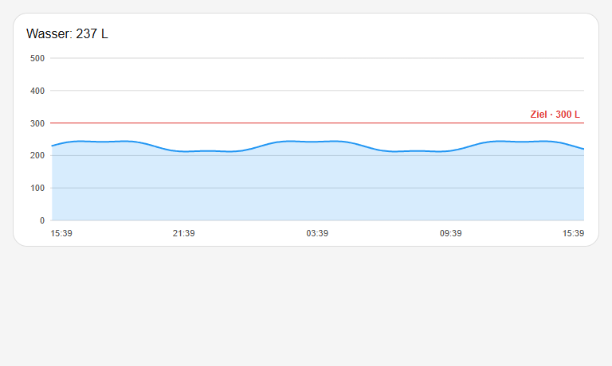

# Water History Target Card

A dependency-free Home Assistant Lovelace card that draws Recorder statistics and an editable target in one SVG coordinate system. The target is previewed locally while dragging and written to `input_number` exactly once when the pointer is released.



## Version

Current package version: **v1.0.2**.

## Installation with HACS

1. Open HACS in Home Assistant and select **Custom repositories** from the menu.
2. Add `https://github.com/RobertEmprechtinger/water-history-target-card` as a **Dashboard** repository.
3. Find **Water History Target Card**, install it, and reload the browser when HACS requests it.
4. Add a `custom:water-history-target-card` card to the dashboard using the configuration below.

## Configuration

```yaml
type: custom:water-history-target-card
config_version: 1
entity: sensor.water_tank_level
target_entity: input_number.water_tank_target
hours: 24
period: 5minute
min: 0
max: 500
step: 10
```

| Option | Required | Default | Meaning |
| --- | --- | --- | --- |
| `config_version` | no | `1` | Configuration contract version; other versions are rejected. |
| `entity` | yes | — | Sensor/statistic ID used for the water history and header. |
| `target_entity` | yes | — | `input_number` written through `input_number.set_value`. |
| `hours` | no | `24` | History window in hours. |
| `period` | no | `5minute` | Recorder statistics period: `5minute`, `hour`, `day`, `week`, or `month`. |
| `min` | no | `0` | Lower chart and target bound. |
| `max` | no | `500` | Upper chart and target bound. |
| `step` | no | `10` | Local snap and keyboard increment. |

The line supports mouse, touch, pen, and keyboard. Its tablet-safe 72-pixel hit
area keeps tracking on the window when SVG pointer capture is unavailable, and
the grab offset prevents the line from jumping under the finger. Arrow keys
change one step, Page Up/Down ten steps, and Home/End select the bounds. Pointer
cancellation never writes.

The current target is also shown as a button at the top right. It opens an
accessible numeric dialog and accepts only values inside the configured range
that match the configured step. Dragging, keyboard input, and the dialog all
reuse the same exactly-once service-call path. If Home Assistant does not
confirm a write through the target entity within five seconds, the preview is
reverted and a visible status message is shown.

## Data and permissions

The card uses the public Home Assistant frontend interfaces `hass.callWS` and `hass.callService`. History is requested with `recorder/statistics_during_period`, `types: [mean]`; there are no private Home Assistant components, external scripts, CDNs, or runtime dependencies.

The card has no telemetry, cookies, external transmission, or local storage. Recorder statistics remain inside the authenticated Home Assistant browser session.

The sensor must be recorded and expose statistics for the configured period. A user can only write the target if their Home Assistant permissions allow the corresponding service call.

## Manual installation

1. Copy `water-history-target-card.js` to `/config/www/water-history-target-card/water-history-target-card.js`.
2. Add `/local/water-history-target-card/water-history-target-card.js` as a JavaScript module resource.
3. Reload the browser without cache.

## Development

```text
npm test
```

The tests use Node's built-in test runner and require no installed packages.

The optional visual smoke test is development-only. Serve the repository parent on `127.0.0.1:8091`, then pass trusted local paths for the Node module bundle and browser executable:

```text
node tests/visual-smoke.cjs "<trusted-local-node_modules>" "<trusted-local-browser-executable>"
```

The script loads Playwright only from the supplied module directory and launches only the supplied local browser. Do not pass downloaded or untrusted paths.

## License

MIT, see `LICENSE`.
